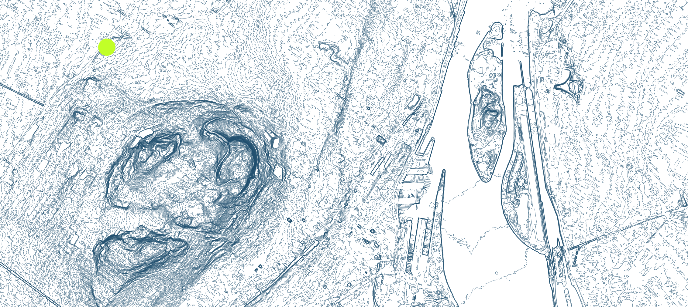
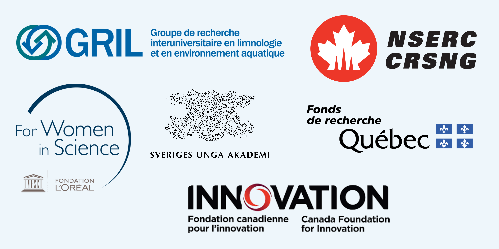

{fig-align="center"}

## Welcome

The Watershed Lab is an interdisciplinary research group studying watershed processes, with focus on biogeochemistry and hydrology. We want to better understand watershed's inner-workings and how they may respond to environmental changes.

What is a watershed? It is the geospatial unit defined by the natural flow of water on land.

Our research is based mostly on field observations. We combine multiple tools including automated and continuous *in-situ* sensor measurements, isotopic tracers, ground or drone-based imagery including thermal infrared and LIDAR.

We are based at the [departement of geography of University of Montréal](https://geographie.umontreal.ca/accueil/), located at Campus-MIL

{fig-align="center" width="403"}

## How to use this website

This websites serves as a **diffusion platform** for the research we do collectively in the lab.

Here, you will find:

-   Tutorials and data viz material in the educational resources page.

-   Individual portfolios from team members with more information on their research projects.

-   A list of publications, field sites, tools and equipement that form the core basis of our work.

We hold strong beliefs in the importance of making our science and knowledge accessible.

All material featured here is licensed under the CC-XYZ common. Please use and share accordingly.

## Partners

Our research is supported by

{fig-align="center"}
